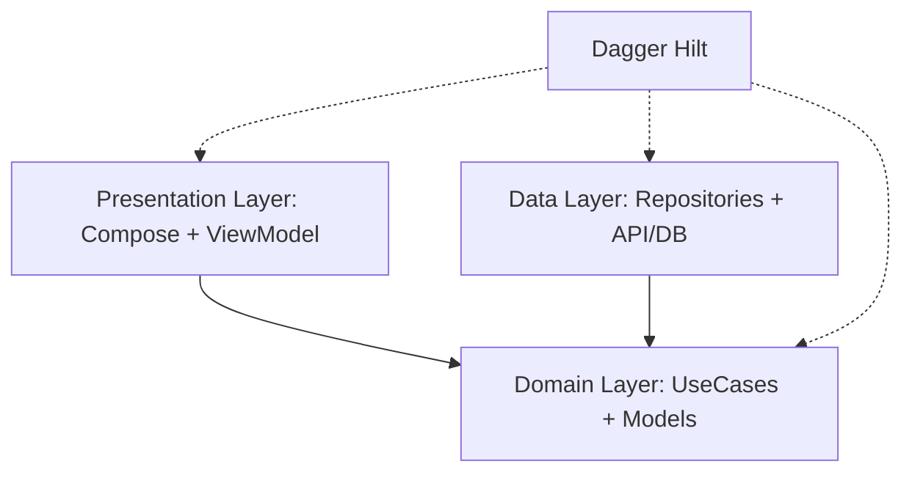
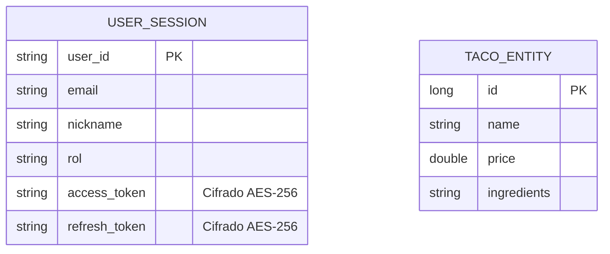

# 🌮 Taco'OS POC - Sistema de Punto de Venta Inteligente


## 📋 Descripción
**Taco'OS** es una solución integral de Punto de Venta (POS) diseñada específicamente para negocios de comida rápida, con un enfoque inicial en taquerías. Esta **Prueba de Concepto (POC)** demuestra una arquitectura robusta, escalable y segura, integrando servicios en la nube, analítica con IA y una experiencia de usuario fluida y moderna.

### 🚀 ¿Qué busca solucionar?
La mayoría de los pequeños negocios de comida operan con procesos manuales o sistemas obsoletos que no ofrecen visión en tiempo real. Taco'OS soluciona:
- **Informalidad en el registro:** Digitalización sencilla de ventas y productos.
- **Gestión de equipos:** Control de cajeros y roles (Administrador vs. Cajero).
- **Seguridad de datos:** Protección de información sensible y sesiones mediante cifrado de hardware.
- **Toma de decisiones:** Insights basados en datos para optimizar inventarios y ventas.

---

## ✨ Características Principales
- **Autenticación Segura:** Inicio de sesión con Google utilizando la API de Credentials de Android.
- **Gestión de Negocio:** Registro de establecimientos, giros y ubicaciones.
- **Control de Equipo:** Visualización y gestión de la lista de cajeros.
- **Arquitectura Clean:** Separación total de lógica de negocio, datos y presentación.
- **Seguridad Avanzada:** 
  - Almacenamiento cifrado (AES-256) para tokens de sesión.
  - Configuración de seguridad de red que prohíbe tráfico no cifrado (HTTP).
  - Redacción de información sensible en logs.
- **Modo Offline:** Persistencia local mediante Room Database para garantizar operatividad sin internet.

---

## 🛠️ Stack Tecnológico
- **Lenguaje:** [Kotlin](https://kotlinlang.org/)
- **UI:** [Jetpack Compose](https://developer.android.com/compose)
- **DI:** [Dagger Hilt](https://dagger.dev/hilt/)
- **Red:** [Retrofit](https://square.github.io/retrofit/) + [OkHttp](https://square.github.io/okhttp/)
- **Persistencia:** [Room](https://developer.android.com/training/data-storage/room) + [DataStore](https://developer.android.com/topic/libraries/architecture/datastore)
- **Seguridad:** [Android Security Crypto](https://developer.android.com/topic/security/data)
- **Navegación:** Jetpack Navigation Compose

---

## 🏗️ Arquitectura y Diagramas

### Arquitectura de Software
El proyecto sigue **Clean Architecture** y el patrón **MVVM/MVI**:



### Modelo de Datos (ER)
Estructura actual de la base de datos local y sesión:



---

## ⚙️ Instalación y Configuración

### Requisitos Previos
- Android Studio Ladybug o superior.
- JDK 17.
- Dispositivo Android o Emulador con API 26 (Android 8.0) o superior.

### Clonar el Repositorio
```bash
git clone https://github.com/tu-usuario/Taco-Os.git
cd Taco-Os/POC
```

### Configuración de API
La aplicación está configurada para conectarse a un servidor local por defecto:
- URL Base: `http://10.0.2.2:8080/` (Alias del host en el emulador).
- Asegúrate de tener el backend corriendo o ajusta la URL en `NetworkModule.kt`.

### Ejecución de Pruebas
Para ejecutar las pruebas unitarias:
```bash
./gradlew test
```

---

## 👥 Equipo de Desarrollo
Este proyecto ha sido impulsado por un equipo apasionado por la tecnología y la gastronomía:

- **Faner Santander** - *Desarrollo Mobile, Backend & Cloud, UI/UX*
- **Jesus** - *Desarrollo Mobile, Backend & Cloud, UI/UX*
- **Alejandro** - *Data Science*

---

## 📄 Licencia
Este proyecto es una Prueba de Concepto (POC) y está bajo la licencia [MIT](LICENSE).
